<!-- hero: monochrome ASCII portrait (types in) beside a neofetch-style info
     panel. regenerate portrait: python scripts/prep_photo.py <photo> &&
     python scripts/make_ascii_svg.py ; info panel: python scripts/make_info_card.py -->

<!-- animated contribution graph: real data, boxes reveal cell by cell
     (regenerated daily by .github/workflows/update-profile-art.yml) -->

<h3><code>shubh@github ~ $ ./contributions.sh</code></h3>

 
 

<h3><code>shubh@github ~ $ whoami</code></h3>

<table>
<tr>
<td valign="top"></td>
<td valign="top"></td>
</tr>
</table>

 
 

<!-- one line per project: repo link + the single number that makes a recruiter
     click. keep it to one line each -- the portfolio carries the long form. -->

<h3><code>shubh@github ~ $ ls ~/projects</code></h3>

<table>
<tr>
<td><a href="https://github.com/morningstar0521/Nakhrali-Luxury"><code><b>nakhrali-luxury</b></code></a></td>
<td>Live D2C e-commerce · 84 REST endpoints, 1,000+ SKUs, sub-200ms p95 search &nbsp;<a href="https://nakhraliluxury.com/">↗</a></td>
</tr>
<tr>
<td><a href="https://github.com/morningstar0521/Comment-Category-Prediction"><code><b>toxicity-classifier</b></code></a></td>
<td>9-model stacking ensemble over 198K comments · <b>5th / 2,343</b> (top 0.21%)</td>
</tr>
<tr>
<td><a href="https://github.com/morningstar0521/movielens-recommender"><code><b>movielens-recommender</b></code></a></td>
<td>ALS on 25M ratings · <b>+53% NDCG@10</b> over baseline, sub-10ms warm latency</td>
</tr>
<tr>
<td><a href="https://github.com/morningstar0521/Quick-Park"><code><b>quick-park</b></code></a></td>
<td>Flask + Vue parking platform · 500 concurrent users at &lt;200ms p95 · <b>Best Project, IIT Madras</b></td>
</tr>
<tr>
<td><a href="https://minorproject-red.vercel.app/"><code><b>venturelens-ai</b></code></a></td>
<td>Multi-LLM startup validation · Gemini + Groq in parallel, <b>~50% latency cut</b></td>
</tr>
<tr>
<td><a href="https://github.com/morningstar0521/UIDAI-Data-Hackathon-Submission"><code><b>aadhaar-governance</b></code></a></td>
<td>2.4M records · Isolation Forest + Prophet 2030 forecasts · national hackathon</td>
</tr>
</table>

 
 

<h3><code>shubh@github ~ $ ./links.sh</code></h3>

<b>Full-Stack Developer · Applied ML Builder · IIT Madras + RGPV Dual Degree</b>

 

